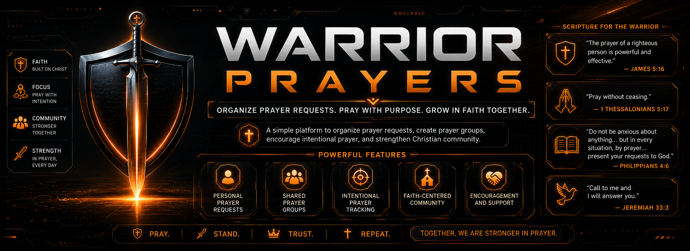

  

# Warrior Prayers

**Warrior Prayers** is a private prayer group management application designed to help churches, ministries, families, and small groups organize prayer requests with care, privacy, and purpose.

The app allows users to create secure invitation-only prayer groups, share prayer requests, pray through active needs, track updates, and record answered prayers.

## Biblical Inspiration

Warrior Prayers is inspired by the biblical call to live a life of constant prayer, faith, perseverance, and intercession.

> **“Pray without ceasing.”**
> **1 Thessalonians 5:17**

> **“Call to me, and I will answer you.”**
> **Jeremiah 33:3**

> **“The prayer of a righteous person is powerful and effective.”**
> **James 5:16**

> **“Continue steadfastly in prayer, watching in it with thanksgiving.”**
> **Colossians 4:2**

> **“Whatever you ask in prayer, believing, you will receive.”**
> **Matthew 21:22**

These verses reflect the heart of the app: helping believers pray together, support one another, and remain faithful in intercession.

---

## 🌐 Web Version

The web version of **Warrior Prayers** is currently under development and can be accessed here:

**https://warriorprayers.replit.app**

> This is a development version and may change frequently as new features are added and improved.

---

## ✨ Purpose

Prayer requests often include deeply personal and sensitive information. Warrior Prayers was created to provide a safe and organized space where trusted people can intercede for one another without exposing private details publicly.

The goal is simple:

> Help prayer warriors stay connected, organized, and faithful in prayer while protecting the confidentiality of each request.

---

## 🙏 Key Features

* Private invitation-only prayer groups
* User authentication
* Group roles and permissions
* Prayer request creation and management
* Prayer categories and urgency levels
* Anonymous prayer requests
* Option to hide names and display only initials
* Prayer request updates
* Request closure with reasons:

  * No Longer Needed
  * Answered Prayer
* Answered prayer testimonies
* “I am praying” commitment tracking
* Comments and updates
* Compact Prayer mode
* Detailed Prayer mode
* Prayer session tracking
* Multilingual support:

  * English
  * Portuguese
  * Spanish
* Mobile-first responsive design
* Dark modern interface with orange accents
* Encrypted storage for sensitive prayer content where technically possible

---

## 🔐 Privacy First

Warrior Prayers is designed with privacy as a core principle.

Prayer requests may contain sensitive personal details, so the app is built around:

* Private group access
* Invitation-only membership
* Backend permission validation
* Group-based access control
* Encrypted sensitive fields
* Anonymous request support
* Name privacy using initials
* No public prayer feeds
* No public group discovery

Only active members of a prayer group should be able to view that group’s prayer requests.

---

## 📱 Mobile-First Design

The app is designed primarily for mobile use, while still supporting tablets and desktop computers.

The interface is:

* Clean
* Modern
* Dark-themed
* Orange-accented
* Responsive
* Touch-friendly
* Focused on prayer, not distraction

Prayer Mode is designed to provide a calm and focused experience for users praying through a list of requests.

---

## 🧭 Prayer Modes

Warrior Prayers includes two prayer modes:

### Compact Prayer

A summarized prayer guide that groups active requests by category.

This mode is useful when a group has many prayer requests and the user wants a concise overview.

### Detailed Prayer

A request-by-request guide that includes the necessary details, updates, urgency, category, and suggested prayer focus.

This mode is designed for longer and more intentional prayer sessions.

---

## 🌎 Internationalization

The application is designed with multilingual support from the beginning.

Initial supported languages:

* English
* Portuguese
* Spanish

All user-facing text should use translation keys so additional languages can be added in the future.

---

## 🛠️ Suggested Tech Stack

This project is intended to be built as a full-stack responsive web application.

Suggested stack:

* Frontend: React
* Styling: Tailwind CSS
* Backend: Node.js / Express
* Database: SQL or PostgreSQL-compatible database
* Authentication: Replit Auth or equivalent authentication provider
* Internationalization: i18n translation files
* Encryption: server-side encryption for sensitive fields
* Deployment: Replit Deployments or equivalent hosting

---

## 📌 MVP Scope

The first MVP focuses on:

* Authentication
* User profiles
* Private prayer groups
* Group invitations
* Member roles
* Prayer requests
* Categories
* Urgency levels
* Privacy settings
* Prayer request updates
* Request closure
* Prayer history
* Compact Prayer
* Detailed Prayer
* Prayer session tracking
* Multilingual support
* Mobile-first responsive layout

---

## 🚧 Future Enhancements

Potential future features include:

* Native iOS app
* Native Android app
* Push notifications
* Email notifications
* WhatsApp integration
* Daily prayer reminders
* Church-level administration dashboard
* Advanced reporting
* End-to-end group-based encryption
* Prayer campaigns
* Prayer calendars
* Voice notes
* Secure attachments

---

## ❤️ Vision

Warrior Prayers exists to strengthen prayer communities by making it easier to care, intercede, follow up, and celebrate answered prayers together.

This project is built with the belief that prayer is personal, powerful, and worthy of being handled with both faith and responsibility.
